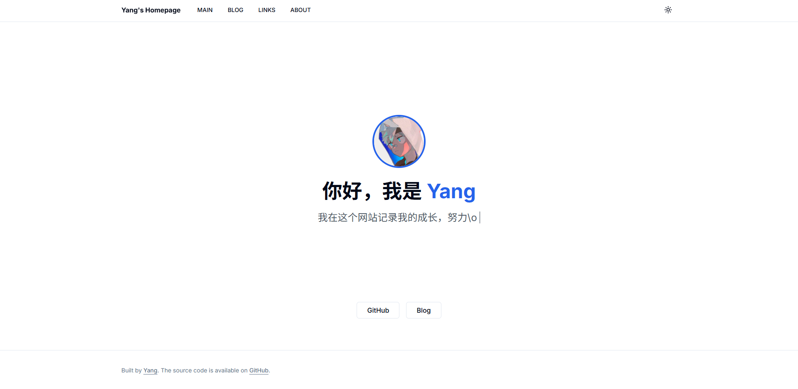

# 🚀 个人主页项目

[](LICENSE)
[](https://nextjs.org/)
[](https://tailwindcss.com/)
[](https://react.dev/)
[](https://typecho.org/)

这是我的个人主页项目，基于 [Next.js](https://nextjs.org/) + React 19 + Tailwind CSS + Shadcn/ui，Blog部分使用 [Typecho Api]()二次开发而成。

---

## ✨ 主要特性

- 现代扁平化设计，极简美观
- 响应式布局，移动端友好
- SEO 优化，字体预加载
- 支持深色模式，平滑切换

---

## 🚀 快速开始

1. **安装依赖**

   ```bash
   npm install
   ```

2. **启动开发环境**

   ```bash
   npm run dev
   ```

3. **访问项目**

   [http://localhost:3000](http://localhost:3000)

---

## 📝 目录结构

- `/src/app`：页面与路由
- `/src/components`：UI 组件
- `/public`：静态资源（如头像等）

---

## 🖼️ 效果预览



---

## 📖 相关链接

- [myblog](https://hkyang233.com)
- [Shadcn/ui](https://ui.shadcn.com/)
- [Next.js](https://nextjs.org/)

---

## 📄 License

[Apache-2.0](LICENSE)
